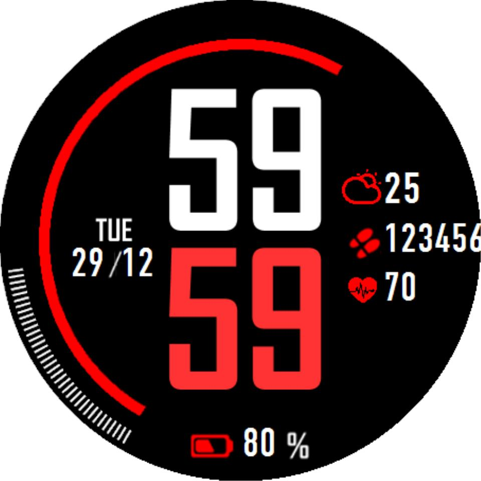

# 简约数字表盘

## 描述

**捐赠: [http://paypal.me/muyids](http://paypal.me/muyids)**

数据字段设置:

-   心率
-   电量
-   步数
-   爬楼层数
-   卡路里
-   每天活动分钟数
-   距离
-   空气湿度

## 使用说明

### 天气接入

请在 [OpenWeatherMap](https://openweathermap.org/) 注册账号，获取 API Key；

## 版本更新

-   v3.0.1 2023/07/06 天气默认使用 garmin weather，如果需要使用 openweathermap，请在 setting 中设置 OpenWeatherMap API Key；
-   v3.0.0 2023/07/04 支持多语言；修复在某些设备型号上无法显示指标图标的 bug；整合天气功能，使用 OpenWeatherMap API；
-   v2.0.0 2023/07/02 支持选择主题和数据；调整界面和布局；修复图标和文本对齐的问题；
-   v1.0.0 2023/06/26 第一个版本发布，仍可能存在一些缺陷
